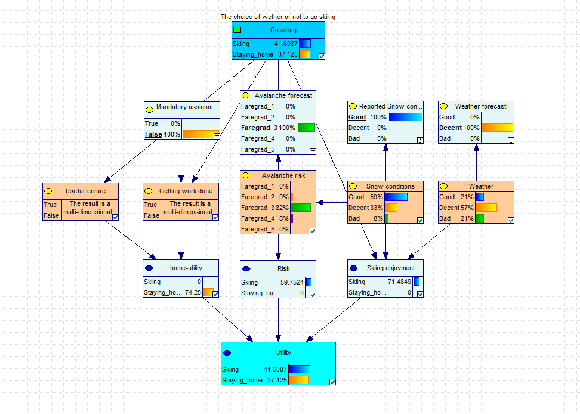
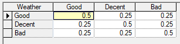
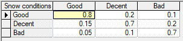
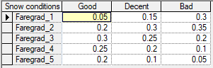

# TDT4171 Assignment 3

## Decision
I chose to create a bayesian network for deciding whether to go to school or   skip school and go skiing in the mountains on a given day. The decision is based on various factors such as the reported avalanche risk, weather forecast, snow conditions and mandatory assignments due that day. Actual variables are in orange, with the evidence variables in white-ish.

## Variables
 I chose four evidence variables: weather forecast, avalanche forecast, reported snow conditions and wether or not theres an assignment due that day. In addition I have five hidden variables: actual weather, snow and avalanche conditions, and the chance of a useful lecture, and the chance of getting any work done if staying home.

### Weather forecast
Weather has three values: good, decent or bad. With the weather forecast having a 50% chance of being correct, and 25% of the two other options. This may downplay the accuracy of weather forecasts, but still feels fairly realistic based on prevous experiences.

### Reported snow conditions
As people have a tendency to exaggerate, the reported snow conditions are often better than the reality. Better snow conditions is also tied to higher avalanche risk.

### Avalanche risk

The avalanche forecast is fairly accurate with 80% chance of being correct. The actual avalanche risk is linked to the snow conditions, since more snow often gives better skiing but higher chance of avalanches. The accuracy of the forecast compared to the real conditions is hard to assess, but often seem failry accurate although of course there are large local variations. (More on that [here](https://varsom.no/snoskredvarsling/om-snoskredvarslingen/?ref=mainmenu))

### Chance of getting work done
If theres an assignment due on the given day, theres a 90% chance I will do it if I stay home, and 5% chance I'll do it after coming home.

If not there's a 60% chance I'll get any work done if I stay home, and 0 if I go skiing.

### Chance of a useful lecture
This assumes there are lectures everyday, and if I stay home I will go to the lecture and have a 75% chance of it being valuable learning. There's naturally a zero percent chance of getting anything useful out of the lectures if skiing

## Utility
The skiing enjoyment is purely subjective and based on a combination of the weather and snow conditions, and of course it's zero if I choose to stay home. Risk is similar, based on the actual avalanche risk, and zero if staying home. The risk factors negatively into the utility function.

Utility from staying home is based on the chance of there being a useful lecture and getting any work done.

All the uility functions go from 0 -> 100 and are calculated in the final utility function in the following way. This is tuned to fit with my personal preference of when to go skiing or not.

## Assumptions and simplifications
I have neglected a link between weather and snow conditons/avalance risk wich exists but can be hard to accuratley quantify in the real world. The expected utility of staying home is also heavily simplified, as I didn't want to start implementing a utility function based on schedule and so on. Different sunjects should probably be weighted differently and the assignments could have a weighting based on how many more needed to take the exam in the course and so forth.

The weather, avalanche risk and snow conditions have been modelled as discrete time-invariant variables iwch is a dramatic oversimplification. In reality they change thorughout the day, at different altitudes and are dependent on previous days and so forth.

There are also many other factors wich influences my decision in real life, such as plans other than school, fatigue, money for gas and other things. In order to keep the network simple I have ignored these and focused on what I tought was most important.

## Conclusion
This is a very simplified view of the world, ignoring some dependencies between included variables and excluding a lot of variables altogether. But I still found it to make choses I tended to mostly agree with. For example, the system never reccomends skiing when the avalanche forecast is at risk level four or five, and never reccomends school when the weather and snow is perfect and the avalanche risk low.

In the cases between the extremes the utility of staying home vs. skiing is failry close, and would probably be decided by other factor not modeled in this system.
